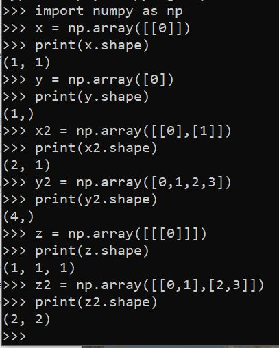
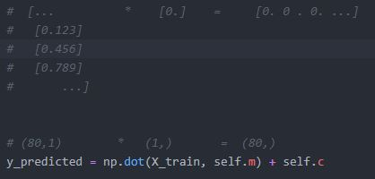

<h2>Support Vector Machine with Numpy and Python</h2>

<h3>Intro</h3>
<ul>
  <li>Splitting the data in the best posible way - to get two data categories/labels.</li>
  <li>The key aspect is to split the data in the as much optimal way as possible so that new coming in data can be precisely clasified.</li>
  <li>The data can be split in different ways. However, the line making the biggest gap between two classes is chosen as the separation line.</li>
   
   
  
   
  <li>Credits go to en.wikipedia.org/wiki/Support_vector_machine</li>
   
  <li>Support vectors are extreme points of a specific data set of one category.</li>
  <li>Support vectors are those elements of the data that makes the biggest possible separation gap.</li>
  <li>Distance margin is the distance between support vectors from both data classes.</li>
  <li>Once we create an optimal separation line we can easily see which side a new data fits in.</li>
  <li>The smaller the distance margin, the higher a chance of miss-classification is.</li>
  <li>If all of the data is placed in one line in 1D then we need to convert it into 2D with <b>kernel</b></li>
  <li>If one data of one class is sourrounded by data of second class we need to convert 2D into 3D with <b>kernel</b></li>
</ul>

<h3>numpy.array().shape</h3>
<ul>
  
</ul>

<h3>numpy.dot()</h3>
<ul>
  <li>Number of columns of array a needs to be as the same as number of rows of array b.</li>
  <li>When execution gets started, the first row of array a is multiplied by the first column of array b, one element at the time.</li>
  <li>Result is the scalar value representing the inner product of two vectors when one dimensional arrays.</li>
  <li>When multi-dimensional arrays then, the result is a new multi-dimensional array.</li>
  <li>Excecution:
     
    - transfroming second array's shape from row into a single column  
    - the first value of the array a is multiplied by the first value of the array b  
    - then second value from the array a is multiplied by the secon second value from the array b etc...  
    - it keeps multipling until the lenght of the first vector is reached  
    - restults from all the multiplications are summed up into one scalar value (with one-dimensional arrays) or value wrapped up in a new calculated array (with multi-dimensional arrays).  
  </li>
   
  
</ul>

<h3>np.amax() np.amin()</h3>
<ul>
  <li>Return the maximum/minimum of an array or maximum/minimum along an axis.</li>
   
  
</ul>
